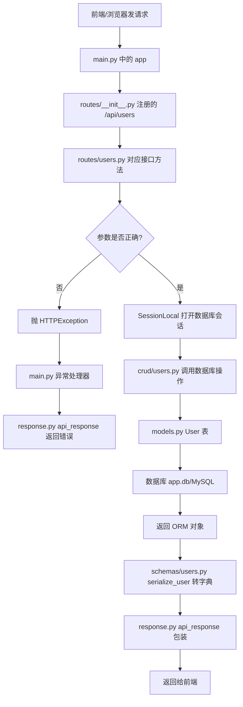

# User 增删改查：后台文件与方法执行流程（小白版）

> 目标：用 `user` 模块做例子，看懂一次请求从“接口地址”到“数据库”，再从“数据库”返回给前端的完整过程。

---

## 1. 先记住一句话

后台代码通常按职责分层：

```text
入口 main.py
  ↓ 注册路由
routes/users.py        接收请求、校验参数、决定调用哪个业务方法
  ↓
crud/users.py          真正操作数据库：查、新增、修改、删除
  ↓
models.py              定义数据库表长什么样
  ↓
database.py            创建数据库连接和 Session
  ↓
response.py            把结果包装成统一返回格式
```

你可以把它想象成餐厅：

| 文件/层级 | 像餐厅里的谁 | 主要职责 |
|---|---|---|
| `main.py` | 餐厅大门/总开关 | 启动服务、创建表、注册所有接口 |
| `routes/users.py` | 服务员 | 接待请求、检查点单内容、告诉厨房做什么 |
| `schemas/users.py` | 点菜单模板 | 规定新增/修改/返回的数据字段 |
| `crud/users.py` | 厨师 | 真正查询、新增、修改、删除数据库数据 |
| `models.py` | 菜品原料表/仓库结构 | 定义 `users` 表有哪些字段 |
| `database.py` | 后厨燃气和水电 | 连接数据库，提供 `SessionLocal()` |
| `response.py` | 打包盒 | 统一接口返回格式 |

---

## 2. User 相关文件在哪里？

```text
service/app/
├── main.py                 # FastAPI 应用入口：启动、初始化数据库、注册路由
├── database.py             # 数据库连接：engine、SessionLocal、Base
├── models.py               # ORM 模型：User 表结构在这里
├── response.py             # 统一响应 api_response()
├── routes/
│   ├── __init__.py         # register_routers()，把 users_router 加到 /api 前缀下
│   └── users.py            # User 接口层：GET/POST/PUT/DELETE /users
├── crud/
│   ├── __init__.py         # 导出 crud 方法，方便 routes 调用 crud.xxx
│   └── users.py            # User 数据库操作层：list/create/update/delete
└── schemas/
    ├── __init__.py         # 导出 schema，方便 routes 调用 schemas.xxx
    └── users.py            # UserCreate/UserUpdate/UserRead/serialize_user
```

---

## 3. User 表长什么样？

位置：`service/app/models.py`

```python
class User(Base):
    __tablename__ = 'users'

    id = 主键
    name = 姓名
    email = 邮箱，唯一
    role = 角色，默认 viewer
    roles = 和 Role 的多对多关系
    created_at = 创建时间
```

数据库里大概是这样一张表：

| id | name | email | role | created_at |
|---:|---|---|---|---|
| 1 | 张三 | zhangsan@example.com | viewer | 2026-05-08 ... |

---

## 4. 后台启动时发生了什么？

位置：`service/app/main.py`

```text
运行服务
  ↓
创建 FastAPI app
  ↓
lifespan() 启动生命周期执行
  ↓
initialize_database()
  ↓
Base.metadata.create_all(bind=engine)  # 根据 models.py 自动创建表
  ↓
register_routers(app)                  # 注册 /api/users 等接口
```

对应代码关系：

| 方法 | 文件 | 做什么 |
|---|---|---|
| `initialize_database()` | `main.py` | 创建数据库表，初始化基础数据 |
| `lifespan()` | `main.py` | 应用启动时调用初始化逻辑 |
| `register_routers(app)` | `routes/__init__.py` | 把 `users_router` 挂到 `/api` 前缀下 |
| `Base.metadata.create_all()` | SQLAlchemy | 根据 `models.py` 里的模型创建表 |

---

## 5. 总流程图：一次 User 请求怎么跑？



---

## 6. 查询用户列表：GET `/api/users`

### 6.1 请求例子

```http
GET /api/users?name=张&page=1&page_size=10
```

### 6.2 执行链路

```text
前端请求 GET /api/users
  ↓
routes/users.py -> read_users(name, page, page_size)
  ↓
clean_string(name) 清理查询条件
  ↓
with SessionLocal() as db 打开数据库会话
  ↓
crud.list_users(db, name, page, page_size) 查询当前页数据
  ↓
crud.count_users(db, name) 查询总数
  ↓
schemas.serialize_user(user) 把 User ORM 对象转成字典
  ↓
api_response(data=payload, total=total) 返回统一格式
```

### 6.3 关键方法解释

| 方法 | 文件 | 作用 |
|---|---|---|
| `read_users()` | `routes/users.py` | 接收查询参数，调用 CRUD 查询 |
| `clean_string()` | `utils.py` | 清理字符串，例如去掉前后空格 |
| `list_users()` | `crud/users.py` | 拼 SQL 查询用户列表 |
| `count_users()` | `crud/users.py` | 统计符合条件的总条数 |
| `serialize_user()` | `schemas/users.py` | 把数据库对象转成前端好读的字典 |
| `api_response()` | `response.py` | 包装成统一 JSON 返回 |

### 6.4 `crud.list_users()` 做了什么？

```text
select(models.User)                 # 查询 User 表
  ↓
如果 name 有值：where name like %name%
  ↓
order_by(User.id.asc())             # 按 id 升序
  ↓
offset + limit                      # 分页
  ↓
db.scalars(statement)               # 执行 SQL
```

---

## 7. 新增用户：POST `/api/users`

### 7.1 请求例子

```http
POST /api/users
Content-Type: application/json

{
  "name": "李四",
  "email": "lisi@example.com",
  "role": "viewer"
}
```

### 7.2 执行链路

```text
前端请求 POST /api/users
  ↓
routes/users.py -> add_user(data)
  ↓
取出 name/email/role 并清理字符串
  ↓
校验：姓名不能为空、邮箱格式正确、角色合法
  ↓
组装 schemas.UserCreate(name, email, role)
  ↓
with SessionLocal() as db 打开数据库会话
  ↓
crud.create_user(db, payload)
  ↓
models.User(**payload.model_dump()) 创建 User ORM 对象
  ↓
db.add(user)       加入待保存队列
  ↓
db.commit()        提交到数据库
  ↓
db.refresh(user)   重新读取数据库生成的 id/created_at
  ↓
serialize_user(user) 转字典
  ↓
api_response(data=response_data, message='用户已创建。')
```

### 7.3 为什么要分 `UserCreate`？

位置：`schemas/users.py`

```python
@dataclass(slots=True)
class UserCreate:
    name: str
    email: str
    role: str = 'viewer'
```

它的作用是：

1. 只保存“新增用户需要的字段”。
2. 不让前端随便传 `id`、`created_at` 这类不该自己填写的字段。
3. 通过 `model_dump()` 统一转成字典，方便 `models.User(**字典)` 创建对象。

### 7.4 邮箱重复会怎样？

`models.User.email` 设置了 `unique=True`，所以数据库不允许两个用户邮箱一样。

```text
邮箱重复
  ↓
db.commit() 时数据库报 IntegrityError
  ↓
routes/users.py 捕获 IntegrityError
  ↓
db.rollback() 回滚
  ↓
返回：邮箱已存在，请更换。
```

---

## 8. 修改用户：PUT `/api/users`

### 8.1 请求例子

```http
PUT /api/users
Content-Type: application/json

{
  "id": 1,
  "name": "李四-已修改",
  "email": "lisi_new@example.com",
  "role": "editor"
}
```

### 8.2 执行链路

```text
前端请求 PUT /api/users
  ↓
routes/users.py -> update_user(data)
  ↓
parse_int(data.get('id')) 把 id 转成整数
  ↓
校验：id、姓名、邮箱、角色
  ↓
组装 schemas.UserUpdate(id, name, email, role)
  ↓
with SessionLocal() as db
  ↓
crud.update_user(db, payload)
  ↓
db.get(models.User, payload.id) 根据 id 找用户
  ↓
找不到：raise ValueError('User not found')
  ↓
找到：循环 payload 字段，把 name/email/role 写回 user 对象
  ↓
跳过 id，不修改主键
  ↓
db.commit()
  ↓
db.refresh(user)
  ↓
serialize_user(user)
  ↓
api_response(data=response_data, message='用户已更新。')
```

### 8.3 修改的核心点

位置：`crud/users.py`

```text
user = db.get(models.User, payload.id)   # 先根据 id 找到旧数据
for key, value in payload.model_dump().items():
    if key == 'id':
        continue                         # id 是主键，只用来找人，不应该修改
    setattr(user, key, value)            # 把新值写入旧对象
commit + refresh                         # 保存并刷新
```

---

## 9. 删除用户：DELETE `/api/users`

当前代码支持两种删除方式：

| 方式 | 接口 | 参数位置 |
|---|---|---|
| 请求体删除 | `DELETE /api/users` | JSON Body：`{"id": 1}` |
| 路径删除 | `DELETE /api/users/{user_id}` | URL 路径：`/api/users/1` |

### 9.1 请求例子一：Body 删除

```http
DELETE /api/users
Content-Type: application/json

{
  "id": 1
}
```

### 9.2 请求例子二：路径删除

```http
DELETE /api/users/1
```

### 9.3 执行链路

```text
前端请求 DELETE /api/users 或 /api/users/1
  ↓
routes/users.py -> delete_user(data) 或 delete_user_by_path(user_id)
  ↓
校验 id 是否大于 0
  ↓
with SessionLocal() as db
  ↓
crud.delete_user(db, user_id)
  ↓
db.get(models.User, user_id) 根据 id 找用户
  ↓
找不到：return False
  ↓
找到：db.delete(user)
  ↓
db.commit()
  ↓
返回 True
  ↓
routes 判断 True/False
  ↓
True：api_response(message='用户已删除。')
False：返回 404 用户不存在
```

---

## 10. 四个 CRUD 方法对照表

| 操作 | HTTP 接口 | 路由方法 `routes/users.py` | 数据库方法 `crud/users.py` | Schema |
|---|---|---|---|---|
| 查列表 | `GET /api/users` | `read_users()` | `list_users()`、`count_users()` | `serialize_user()` |
| 新增 | `POST /api/users` | `add_user()` | `create_user()` | `UserCreate`、`serialize_user()` |
| 修改 | `PUT /api/users` | `update_user()` | `update_user()` | `UserUpdate`、`serialize_user()` |
| 删除 | `DELETE /api/users` | `delete_user()` | `delete_user()` | 不需要 |
| 删除 | `DELETE /api/users/{user_id}` | `delete_user_by_path()` | `delete_user()` | 不需要 |

---

## 11. 为什么要这样分文件？

### 11.1 不推荐：所有代码都写在一个文件里

```text
一个 users.py 里既接请求、又校验、又写 SQL、又拼返回
```

坏处：

- 文件会越来越长。
- 想复用数据库方法很难。
- 修改接口时容易误伤数据库逻辑。
- 排查 bug 不知道从哪里看。

### 11.2 推荐：按职责拆开

```text
routes/users.py   只关心接口和参数
crud/users.py     只关心数据库操作
schemas/users.py  只关心数据形状
models.py         只关心表结构
```

好处：

- 新人看代码更有方向。
- 改接口不一定要改数据库层。
- 同一个 `crud.create_user()` 可以被多个接口复用。
- 测试时可以单独测试 CRUD 方法。

---

## 12. 小白阅读代码建议顺序

第一次看后台 CRUD，不要从第一行看到最后一行，建议按下面顺序：

```text
1. 看接口地址
   routes/users.py 里找 @users_router.get/post/put/delete

2. 看入口方法
   例如 add_user()、read_users()、update_user()、delete_user()

3. 看它调用哪个 crud 方法
   例如 crud.create_user()、crud.list_users()

4. 去 crud/users.py 看数据库怎么操作

5. 去 models.py 看 User 表字段

6. 去 schemas/users.py 看请求/返回数据长什么样

7. 最后看 response.py 了解统一返回格式
```

---

## 13. 统一返回格式长什么样？

位置：`service/app/response.py`

所有接口最终大多会调用：

```python
api_response(data=..., message=...)
```

返回结构大概是：

```json
{
  "code": 200,
  "data": {
    "data": [],
    "total": 0
  },
  "message": ""
}
```

新增成功时大概是：

```json
{
  "code": 200,
  "data": {
    "data": {
      "id": 1,
      "name": "李四",
      "email": "lisi@example.com",
      "role": "viewer",
      "role_ids": [],
      "created_at": "2026-05-08T10:00:00"
    }
  },
  "message": "用户已创建。"
}
```

---

## 14. 一句话总结

`routes/users.py` 是“接口门面”，`crud/users.py` 是“数据库动作”，`schemas/users.py` 是“数据模板”，`models.py` 是“表结构”，`database.py` 是“数据库连接”，`response.py` 是“统一返回”。

当你新增一个模块，比如 `商品 product`、`订单 order`，通常也可以照着 `user` 这样设计：

```text
models.py 增加 Product 表
schemas/products.py 定义 ProductCreate/ProductUpdate/ProductRead
crud/products.py 写 create/list/update/delete
routes/products.py 写 GET/POST/PUT/DELETE 接口
routes/__init__.py 注册 products_router
```
